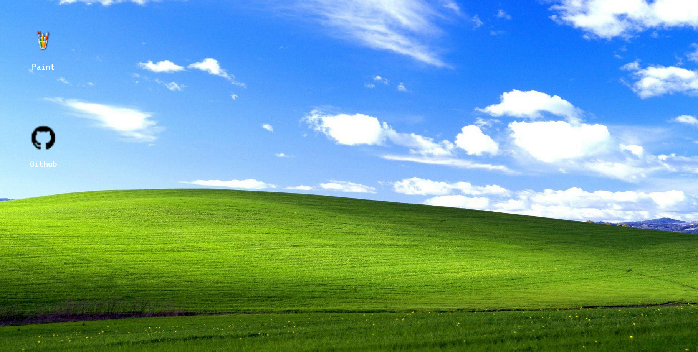

# Paint.astro

This is a Paint clone developed with Astro.
[Paint Astro](https://paint-pink.vercel.app/)



### How to install

1) Clone the repository
```bash
$ git clone https://github.com/dyxgou/paint
$ cd paint
```

2) Install the dependencies with your package manager

```bash
$ npm install
```

3) Run the project
```bash
$ npm dev
```

